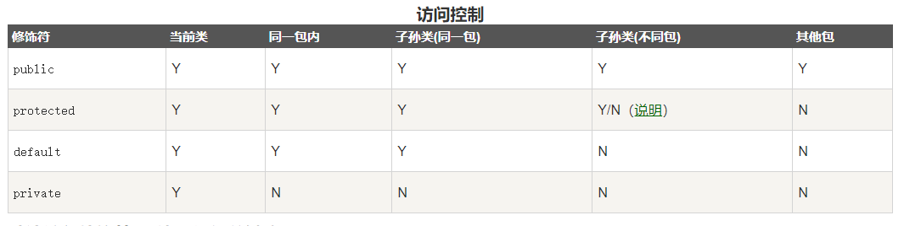

整数类型：byte，short，int，long

浮点数类型：float，double

字符类型：char

布尔类型：boolean

byte：-128 ~ 127 short: -32768 ~ 32767 int: -2147483648 ~ 2147483647 long: -9223372036854775808 ~ 9223372036854775807

Java语言对布尔类型的存储并没有做规定，因为理论上存储布尔类型只需要1 bit，但是通常JVM内部会把boolean表示为4字节整数 引用类型的变量可以指向一个空值null，它表示不存在，即该变量不指向任何对象。例如：

抽象方法和抽象类 https://www.liaoxuefeng.com/wiki/1252599548343744/1259544070059520
抽象类不能实例化

```aidl
abstract class Person {
    public abstract void run();
}
```

```aidl
public static void main(String[] args)
String[] args 代表命令行模式运行的参数，数组模式

https://www.liaoxuefeng.com/wiki/1252599548343744/1259544070059520
```

```aidl
public class Main {
    public static void main(String[] args) {
        int[][] ns = {
            { 1, 2, 3, 4 },
            { 5, 6, 7, 8 },
            { 9, 10, 11, 12 }
        };
        System.out.println(ns.length); // 3
    }
}
```

static 关键字用来声明独立于对象的静态方法。静态方法不能使用类的非静态变量。静态方法从参数列表得到数据，然后计算这些数据。



if简写 `if (myList[i] > max) max = myList[i];`

for-each

```aidl
double[] myList = {1.9, 2.9, 3.4, 3.5};
 
      // 打印所有数组元素
      for (double element: myList) {
         System.out.println(element);
      }
```

# 数组用法 https://www.runoob.com/java/java-array.html

# 日期时间 https://www.runoob.com/java/java-date-time.html

# 正则表达式 https://www.runoob.com/java/java-regular-expressions.html

三元运算 return num1 > num2 ? num1 : num2;

# super and this 关键字

```aidl
class Animal {
  void eat() {
    System.out.println("animal : eat");
  }
}
 
class Dog extends Animal {
  void eat() {
    System.out.println("dog : eat");
  }
  void eatTest() {
    this.eat();   // this 调用自己的方法
    super.eat();  // super 调用父类方法
  }
}
 
public class Test {
  public static void main(String[] args) {
    Animal a = new Animal();
    a.eat();
    Dog d = new Dog();
    d.eatTest();
  }
}
```

同步和异步：同步和异步是针对应用程序和内核的交互而言的，同步指的是用户进程触发IO 操作并等待或者轮询的去查看IO 操作是否就绪，而异步是指用户进程触发IO 操作以后便开始做自己的事情，而当IO 操作已经完成的时候会得到IO 完成的通知。

阻塞和非阻塞是针对于进程在访问数据的时候，根据IO操作的就绪状态来采取的不同方式，说白了是一种读取或者写入操作方法的实现方式，阻塞方式下读取或者写入函数将一直等待，而非阻塞方式下，读取或者写入方法会立即返回一个状态值。

List是一个接口，而ArrayList是List接口的一个实现类。 ArrayList类继承并实现了List接口。
因此，List接口不能被构造，也就是我们说的不能创建实例对象，但是我们可以像下面那样为List接口创建一个指向自己的对象引用，而ArrayList实现类的实例对象就在这充当了这个指向List接口的对象引用。

BIO (Blocking I/O): 同步阻塞 I/O 模式，数据的读取写入必须阻塞在一个线程内等待其完成。在活动连接数不是特别高（小于单机 1000）的情况下，这种模型是比较不错的，可以让每一个连接专注于自己的 I/O
并且编程模型简单，也不用过多考虑系统的过载、限流等问题。线程池本身就是一个天然的漏斗，可以缓冲一些系统处理不了的连接或请求。但是，当面对十万甚至百万级连接的时候，传统的 BIO 模型是无能为力的。因此，我们需要一种更高效的 I/O
处理模型来应对更高的并发量。 NIO (Non-blocking/New I/O): NIO 是一种同步非阻塞的 I/O 模型，在 Java 1.4 中引入了 NIO 框架，对应 java.nio 包，提供了 Channel ,
Selector，Buffer 等抽象。NIO 中的 N 可以理解为 Non-blocking，不单纯是 New。它支持面向缓冲的，基于通道的 I/O 操作方法。 NIO 提供了与传统 BIO 模型中的 Socket 和
ServerSocket 相对应的 SocketChannel 和 ServerSocketChannel
两种不同的套接字通道实现,两种通道都支持阻塞和非阻塞两种模式。阻塞模式使用就像传统中的支持一样，比较简单，但是性能和可靠性都不好；非阻塞模式正好与之相反。对于低负载、低并发的应用程序，可以使用同步阻塞 I/O
来提升开发速率和更好的维护性；对于高负载、高并发的（网络）应用，应使用 NIO 的非阻塞模式来开发 AIO (Asynchronous I/O): AIO 也就是 NIO 2。在 Java 7 中引入了 NIO 的改进版 NIO
2,它是异步非阻塞的 IO 模型。异步 IO 是基于事件和回调机制实现的，也就是应用操作之后会直接返回，不会堵塞在那里，当后台处理完成，操作系统会通知相应的线程进行后续的操作。AIO 是异步 IO 的缩写，虽然 NIO
在网络操作中，提供了非阻塞的方法，但是 NIO 的 IO 行为还是同步的。对于 NIO 来说，我们的业务线程是在 IO 操作准备好时，得到通知，接着就由这个线程自行进行 IO 操作，IO 操作本身是同步的。查阅网上相关资料，我发现就目前来说
AIO 的应用还不是很广泛，Netty 之前也尝试使用过 AIO，不过又放弃了。

# jar包

从Java 9开始，JDK又引入了模块（Module）。

什么是模块？这要从Java 9之前的版本说起。

我们知道，.class文件是JVM看到的最小可执行文件，而一个大型程序需要编写很多Class，并生成一堆.class文件，很不便于管理，所以，jar文件就是class文件的容器。

在Java 9之前，一个大型Java程序会生成自己的jar文件，同时引用依赖的第三方jar文件，而JVM自带的Java标准库，实际上也是以jar文件形式存放的，这个文件叫rt.jar，一共有60多M。

# 内部类

https://www.liaoxuefeng.com/wiki/1252599548343744/1376414781669409

# 定义常量

在Java中，我们可以通过static final来定义常量。例如，我们希望定义周一到周日这7个常量，可以用7个不同的int表示：

```java
public class Weekday {
    public static final int SUN = 0;
    public static final int MON = 1;
    public static final int TUE = 2;
    public static final int WED = 3;
    public static final int THU = 4;
    public static final int FRI = 5;
    public static final int SAT = 6;
}
```

使用常量的时候，可以这么引用：

```aidl
if (day == Weekday.SAT || day == Weekday.SUN) {
// TODO: work at home
}
```

# 枚举类

https://www.liaoxuefeng.com/wiki/1252599548343744/1260473188087424

# 记录类

https://www.liaoxuefeng.com/wiki/1252599548343744/1331429187256353

# 反射

https://www.liaoxuefeng.com/wiki/1252599548343744/1255945147512512

# 注解

https://www.liaoxuefeng.com/wiki/1252599548343744/1265102803921888

作用在代码的注解是

@Override - 检查该方法是否是重写方法。如果发现其父类，或者是引用的接口中并没有该方法时，会报编译错误。 @Deprecated - 标记过时方法。如果使用该方法，会报编译警告。 @SuppressWarnings -
指示编译器去忽略注解中声明的警告。 作用在其他注解的注解(或者说 元注解)是:

@Retention - 标识这个注解怎么保存，是只在代码中，还是编入class文件中，或者是在运行时可以通过反射访问。 @Documented - 标记这些注解是否包含在用户文档中。 @Target - 标记这个注解应该是哪种 Java
成员。 @Inherited - 标记这个注解是继承于哪个注解类(默认 注解并没有继承于任何子类)
从 Java 7 开始，额外添加了 3 个注解:

@SafeVarargs - Java 7 开始支持，忽略任何使用参数为泛型变量的方法或构造函数调用产生的警告。 @FunctionalInterface - Java 8 开始支持，标识一个匿名函数或函数式接口。 @Repeatable
- Java 8 开始支持，标识某注解可以在同一个声明上使用多次。

# 读取properties文件

https://www.liaoxuefeng.com/wiki/1252599548343744/1265119084411136